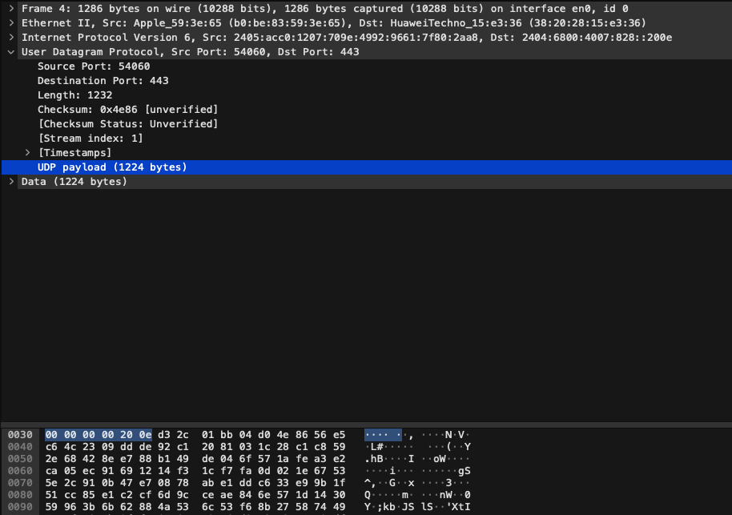
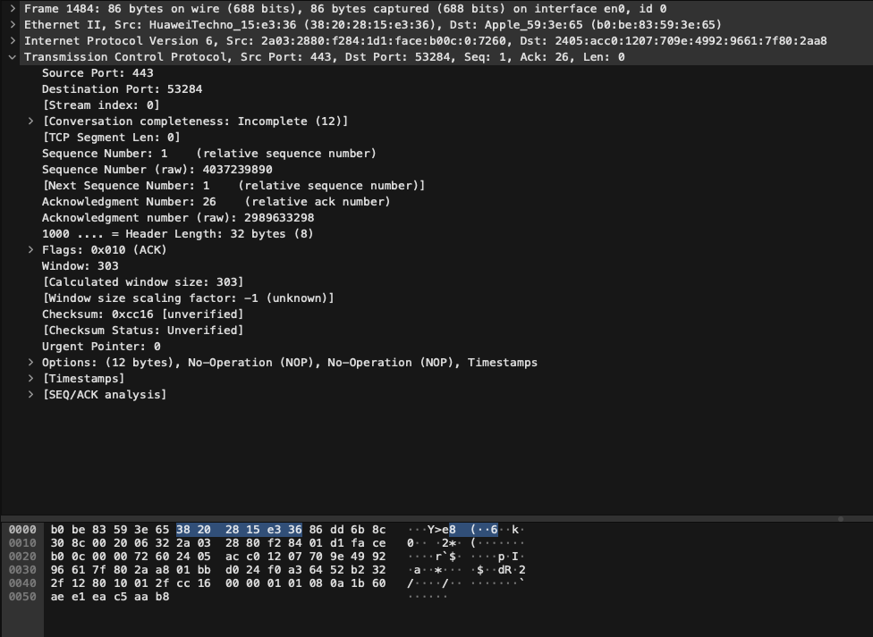

# Network Protocol Information

## UDP Header

### Question 1: What is the size of the UDP header?
The UDP header is 8 bytes (64 bits) long.

### Question 2: What are the different fields in the UDP header?
The UDP header consists of the following fields:
- Source Port (16 bits)
- Destination Port (16 bits)
- Length (16 bits)
- Checksum (16 bits)

### Question 3: Describe the fields in the UDP header.
1. **Source Port (16 bits)**:
   - The port number of the sending process.

2. **Destination Port (16 bits)**:
   - The port number of the receiving process.

3. **Length (16 bits)**:
   - The length of the UDP header and data. The minimum value is 8 bytes (the size of the header).

4. **Checksum (16 bits)**:
   - Used for error-checking of the header and data.

## TCP Header

### Question 4: What is the size of the TCP header?
The size of the TCP header is a minimum of 20 bytes (160 bits), but it can be larger if options are used.

### Question 5: What are the different fields in the TCP header?
The TCP header consists of the following fields:
- Source Port (16 bits)
- Destination Port (16 bits)
- Sequence Number (32 bits)
- Acknowledgment Number (32 bits)
- Data Offset (4 bits)
- Reserved (3 bits)
- Flags (9 bits)
- Window Size (16 bits)
- Checksum (16 bits)
- Urgent Pointer (16 bits)
- Options (variable length)

### Question 6: Describe the fields in the TCP header.
1. **Source Port (16 bits)**:
   - The port number of the sending process.

2. **Destination Port (16 bits)**:
   - The port number of the receiving process.

3. **Sequence Number (32 bits)**:
   - The sequence number of the first byte of data in this segment.

4. **Acknowledgment Number (32 bits)**:
   - If the ACK flag is set, this field contains the value of the next sequence number that the sender is expecting to receive.

5. **Data Offset (4 bits)**:
   - The size of the TCP header in 32-bit words.

6. **Reserved (3 bits)**:
   - Reserved for future use and should be set to zero.

7. **Flags (9 bits)**:
   - Control flags such as URG, ACK, PSH, RST, SYN, and FIN.

8. **Window Size (16 bits)**:
   - The size of the receive window, which specifies the number of bytes that the sender is willing to receive.

9. **Checksum (16 bits)**:
   - Used for error-checking of the header and data.

10. **Urgent Pointer (16 bits)**:
   - If the URG flag is set, this field points to the sequence number of the byte following urgent data.

11. **Options (variable length)**:
   - Optional additional fields that can extend the header size.

## Capturing Packets in Wireshark

### Question 7: Locate a UDP packet in Wireshark and relate the values to the fields.

Relate the values to the fields:
- **Source Port**: The port number of the sender.
- **Destination Port**: The port number of the receiver.
- **Length**: The length of the UDP header and payload.
- **Checksum**: The checksum value for error-checking.

### Question 8: Locate a TCP packet in Wireshark and explain why the fields have the values they have.

Explain the fields:
- **Source Port**: The port number of the sender, typically a high-numbered ephemeral port.
- **Destination Port**: The port number of the receiver, typically a well-known port (e.g., 80 for HTTP).
- **Sequence Number**: The sequence number of the first byte in this segment.
- **Acknowledgment Number**: The next sequence number the sender expects to receive.
- **Flags**: Control flags indicating the state of the connection (e.g., SYN, ACK, FIN).
- **Window Size**: The size of the sender's receive window.
- **Checksum**: The checksum value for error-checking.
- **Urgent Pointer**: Points to the sequence number of the byte following urgent data if the URG flag is set.
- **Options**: Any optional fields used in the header.

